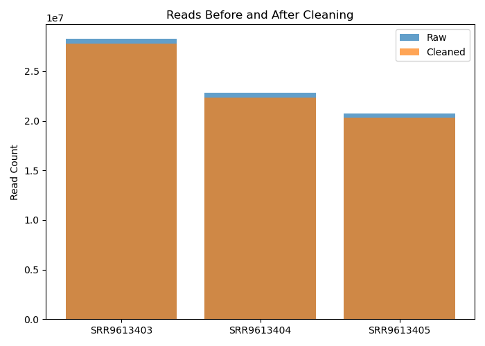
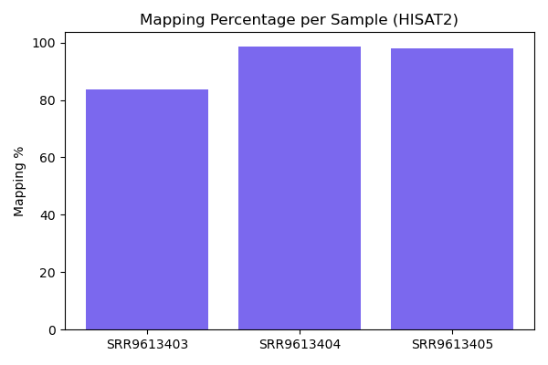

# 01_allignment

## Getting Started

### 1. Clone the Repository

Open a terminal and run:

```bash
git clone https://github.com/FaithIgomodu/BIFS619_GROUP_01.git
cd BIFS619_GROUP_01/01_allignment
```

### 2. Install Required Software

Make sure you have the following tools installed on your computer:

- Python 3.x
- Bash
- FASTP
- HISAT2

For Ubuntu/Linux, you can install with:

```bash
sudo apt update
sudo apt install python3 fastp hisat2
```

### 3. Download Large Files (BAM)

BAM files are stored externally due to GitHub limits.  
Download them from:  
[Google Drive - BIFS619 BAM files](https://drive.google.com/drive/folders/1KW6iuHfbfBAplelDN6l0az1ePj9p1X8c?usp=sharing)

Place the downloaded BAM files in `01_allignment/alignment/bam/`.

### 4. Run the Workflow

#### a. Quality Control

```bash
bash code/read_cleaning.sh
```

This script will process raw FASTQ files, save cleaned reads and QC outputs to `QC/`.

#### b. Alignment

```bash
bash code/align_reads.sh
```

This will align the cleaned reads and generate alignment logs, BAMs, and metrics in `alignment/`.

#### c. Summarize Results

```bash
python3 code/summarize_qc.py
python3 code/summarize_alignment.py
```

Check summary tables and plots in `QC/tables/`, `QC/plots/`, `alignment/tables/`, and `alignment/plots/`.

---

## For more details on folder contents and outputs, see below.

# 01_allignment

This folder contains all files and outputs related to alignment, quality control, and associated analysis scripts for the BIFS619 group project.

## Folder Structure

### `QC/`
Contains outputs from the quality control step, including:
- `cleaned_fastq/`  
  Cleaned FASTQ files and FASTP reports (HTML/JSON) for each sample, generated during sequence quality filtering.
- `plots/`  
  Visualization files (see example below) showing metrics such as pre- and post-cleaning read counts.
- `tables/`  
  CSV tables summarizing QC metrics, including numbers of reads before and after cleaning for each sample.

#### Example QC Output


### `alignment/`
Contains files related to the alignment step:
- `hisat2_index/`  
  HISAT2 index files (`genome.1.ht2` – `genome.8.ht2`) used for mapping reads to the reference genome.
- `logs/`  
  Log files and summary reports from HISAT2 alignment runs.
- `plots/`  
  Barplots visualizing mapping percentages and read counts per sample post-alignment (see example below).
- `tables/`  
  CSV tables reporting alignment metrics for all processed samples.
- `bam/`  
  **BAM files are not stored in this repository due to GitHub’s file size limits.  
  Instead, download them from our Google Drive:**  
  [Google Drive - BIFS619 BAM files](https://drive.google.com/drive/folders/1KW6iuHfbfBAplelDN6l0az1ePj9p1X8c?usp=sharing)

#### Example Alignment Output


### `code/`
Contains analysis scripts used in the pipeline:
- `align_reads.sh`  
  Bash script to run HISAT2 alignments on all samples.
- `read_cleaning.sh`  
  Bash script for performing read cleaning and QC using FASTP.
- `summarize_alignment.py`  
  Python script for summarizing alignment metrics and generating tables/plots.
- `summarize_qc.py`  
  Python script for parsing QC outputs and producing summary tables/plots.

### `test/`
(If present) Contains test files or sample data used for validation.

## Notes

- All file and folder names are referenced directly in analysis scripts.
- For questions or issues, please contact the repository owner or open a GitHub issue.
- See each subfolder’s README, if present, for more details.

---


_Last updated: October 2025_

