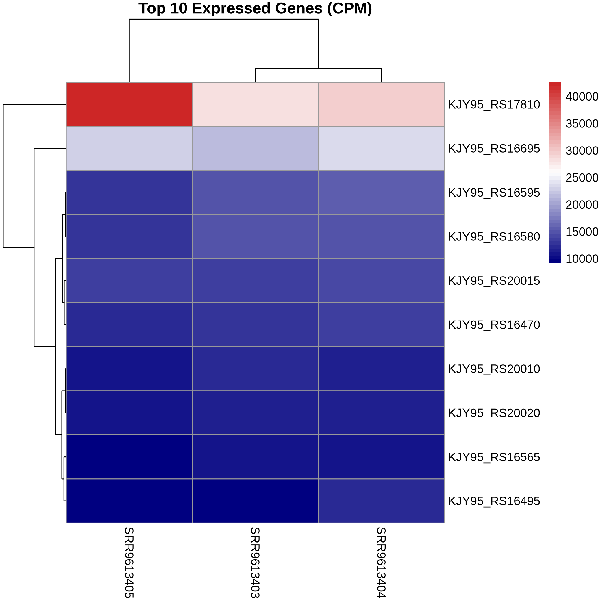

# 02_annotation

## Getting Started


### 1. Clone the Repository

Open a terminal and run:

```bash
git clone https://github.com/FaithIgomodu/BIFS619_GROUP_01.git
cd BIFS619_GROUP_01/02_annotation
```


### 2. Ensure 01_allignment has been run

If you have not run the previous 01_allignment step please go to 01_allignment in the repository and follow the READ ME file in the folder. Only proceed once you have run 01_allignment

### 3. Install Required Software

Make sure you have the following tools installed on your computer:

- Bash
- R
- pheatmap for R

For Ubuntu/Linux, you can install with:

```bash
sudo apt update 
sudo apt install -y r-base r-base-dev 
sudo Rscript -e 'install.packages("pheatmap", repos="https://cloud.r-project.org")'

```

### 4. Prepare Raw Data

Raw FASTQ files are located in the `../00_raw_data/` directory after cloning the repository.  
No need to download BAM files—they will be generated automatically in the alignment step. 

---

### **IMPORTANT: Update File Paths**

Before running any scripts in the `code/` folder, **make sure to update file paths inside each script to match your own computer’s directory structure** (e.g., input/output folders, reference genome locations, etc.).

Open each `.sh` or `.py` file in `02_annotation/code/` and edit any paths as needed.  
Scripts may use absolute or relative paths—adjust them to match where your files are stored.

---

### 5. Run the Workflow

#### a. Execute run_featurecount.sh

This bash script will run featurecounts using the BAM file previously generated in 01_allignment 

```bash
bash code/run_featurecount.sh
```
This script will run featurecounts which will assign mapped reads to annotations that the GTF file has for the reference

#### b. Execute generate_top10_heatmap.R

```bash
bash code/generate_top10_heatmap.R
```

This R script will generate a csv file containing the top 10 genes that are found using the featurecount pipeline 

```bash
bash code/align_reads.sh
```
This will align the cleaned reads and generate BAM files, logs, and metrics in `alignment/`.


---

## For more details on folder contents and outputs, see below.

---
# 02_annotations

This folder contains all files and outputs related to annotation including the scripts to run featurecount and generate the heatmap

## Folder Structure

### `code/`
Contains analysis scripts used in the pipeline:
- `run_featurecount.sh`  
  Bash script to run featurecounts on the using the BAM files from 01_allignment and the .GTF file for the reference
- `generate_top10_heatmap.R`  
  R script in order to generate a heatmap of the top 10 genes reported from featurecount
- 'products_top_10.sh'
  Bash script to get a table of what each top 10 GeneID corresponds to which Gene product


### `counts/`
Contains files related to the annotation and heatmap steps:
- `raw_counts.txt`  
  a text file containing the metadata for featurecounts and all the raw counts for each read with a geneid, Chr, start and end, strand, and BAM information
- `raw_counts.txt.summary`  
  A summary file breaking down how many reads were assigned, matched to the genes in the GTF file, or unassigned, where the read does not match to a gene
- 'top_10_genes.csv'
  A csv file containing the top 10 expressed genes from the R script 
- 'top_10_genes_heatmap.png'
  The image of the heatmap generated from the R script
- 'top_10_genes_products.csv'
  A csv file showing what each GeneID corresponds to which Gene product for the top 10 genes

#### Example Heatmap Output


#### Example Products Top 10 output


### `test/`
(If present) Contains test files or sample data used for validation.

## Notes

- All file and folder names are referenced directly in analysis scripts.
- For questions or issues, please contact the repository owner or open a GitHub issue.
- See each subfolder’s README, if present, for more details.

---

_Last updated: October 2025_

